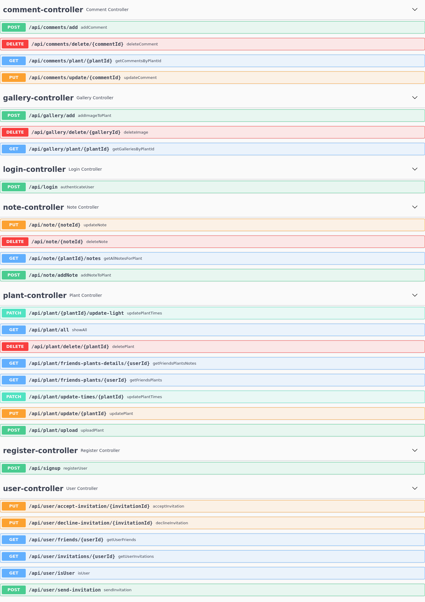

# smart-plant-api

## Swagger Documentation

---

## Images

Here are some images related to the project:

  
Image 1

  
Image 2

---

## Videos

Here are some videos related to the project:

  
Video 1

  
  Unfortunately, GitHub does not support embedding videos directly into README files. However, you can view Video 1 [here](readme/vid.webm).

  
Video 2

  
  Unfortunately, GitHub does not support embedding videos directly into README files. However, you can view Video 2 [here](readme/vid_2.webm).

